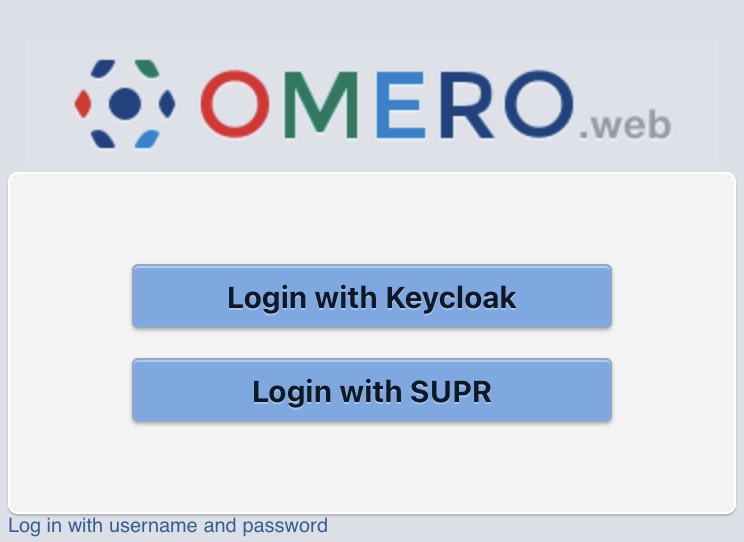

# OMERO.oauth

OMERO.web OAuth2 / OpenID Connect login uses an OMERO administrative account as a bridge instead of local passwords. Review the code and implications before deploying.



The login page shows one button per configured provider; the example above has two providers enabled.

## Fork changes

This is a fork of [OME OMERO.oauth](https://github.com/ome/omero-oauth). Relative to upstream:

- OMERO.web >= 5.29, Django 4.2, and Python 3.9
- Provider config as YAML ([schema](omero_oauth/schema/provider-schema.yaml))
- SUPR provider (site-specific example in [`templates/oauth-providers.yaml`](templates/oauth-providers.yaml))

## Requirements

- Tested with OMERO.web 5.29.0 and Django 4.2 (`Django>=4.2.3,<4.3`, from `omero-web`).
- The Dockerfile installs this package with `pip install .` on `openmicroscopy/omero-web-standalone:5.29.0`

## Installation

Two install paths: the GHCR image this repository publishes, or a pip install into an existing OMERO.web.

### GitHub Actions image

GitHub Actions publish a container image to GHCR on release. The image already contains `omero_oauth` (`pip install .` in the [Dockerfile](Dockerfile)) and copies `templates/` to `/opt/omero/web/config/`. Deploy that image as follows:

1. Merge to `main`. [Release Please](.github/workflows/release-please.yaml) opens a release PR; merging it creates a GitHub release and `vX.Y.Z` tag.
2. [docker-release.yaml](.github/workflows/docker-release.yaml) builds from `openmicroscopy/omero-web-standalone` and pushes to [`ghcr.io/scilifelabdatacentre/omero-oauth`](https://github.com/ScilifelabDataCentre/omero-oauth/pkgs/container/omero-oauth).
3. Deploy the image:
   - **Kubernetes:** pin the version tag in the OMERO.web Kustomize overlay (GitOps, not this repository). Deploy with `kustomize build <overlay>`.
   - **Single image:** pull and run the same tag in place of `omero-web-standalone`, for example `docker pull ghcr.io/scilifelabdatacentre/omero-oauth:vX.Y.Z`.

Release tags: `vX.Y.Z`, `X.Y.Z`, `X.Y`, `X`. Integration builds from `main` use `main` and `main-<sha>`. Pin a version tag; do not use `:latest`.
Provider and OMERO config still come from the baked templates (see Configuration Examples).

### Legacy (OMERO.web standalone)

This path assumes an existing `omero-web-standalone` (or equivalent) with the OMERO.web venv sourced, for example `. /opt/omero/web/venv3/bin/activate`.

```bash
python -m pip install .
omero config append omero.web.apps '"omero_oauth"'
omero web restart
```

Configuration settings:

- `omero.web.oauth.display.name`: Name of the login page, default `OAuth Client`
- `omero.web.oauth.host`: OMERO.server hostname
- `omero.web.oauth.port`: OMERO.server port, optional, default `4064`
- `omero.web.oauth.admin.user`: OMERO admin username, must have permission to create groups, users, and user sessions using sudo
- `omero.web.oauth.admin.password`: Password for OMERO admin username
- `omero.web.oauth.user.timeout`: Maximum session length in seconds, default `86400`
- `omero.web.oauth.group.name`: Default group for new users, will be created if it doesn't exist
- `omero.web.oauth.group.templatetime`: If `True` expand `omero.web.oauth.group.name` using `strftime` to enable time-based groups, default disabled
- `omero.web.oauth.group.perms`: Permissions on default group for new users if it doesn't exist
- `omero.web.oauth.sessiontoken.enable`: Allow new session tokens to be generated that can be used to login to an OMERO client, disabled by default

OAuth2 provider settings:

- `omero.web.oauth.providers`: Either a JSON object with the full provider list `{ "providers": [ ... ] }`, or a filesystem path to a JSON or YAML file with the same shape.
  [See the schema for details on each field.](omero_oauth/schema/provider-schema.yaml)

After a config change, roll the Deployment or recreate the container (GHCR image), or `omero web restart` (legacy).

Users will be able to sign-in using OAuth at https://<OMERO_HOST>/oauth.

It is not possible to login to other OMERO clients in the usual way since no password is set.
If you set `omero.web.oauth.sessiontoken.enable=true` users can go to https://<OMERO_HOST>/oauth/sessiontoken to obtain a new session token.

## Configuration Examples

The Dockerfile copies `templates/` into `/opt/omero/web/config/`. Modify the provider file and
`templates/02-oauth-config.omero` (e.g. which provider path `omero.web.oauth.providers` points to) for your deployment.

### Providers (templates)

`templates/02-oauth-config.omero` sets `omero.web.oauth.providers` to
`/opt/omero/web/config/oauth-providers.yaml`, so `templates/oauth-providers.yaml` is the file the image loads.

The login page shows a button for every entry under `providers`. The template ships one OpenID Connect
provider, SUPR; add further blocks under `providers` if you need more.

SUPR block, placeholders to fill in:

- `<SUPR_CLIENT_ID>`, `<SUPR_CLIENT_SECRET>`
- `<OMERO_HOST>` in the callback `https://<OMERO_HOST>/oauth/callback/supr`

The SUPR URLs and issuer in the template point at the production instance
(`https://supr.naiss.se`). The block also requests the SUPR-specific `enabled-account-resource-98` scope in addition to `openid`,`profile`, and `email`.

Copy the provider config and load the OMERO config:

```bash
cp templates/oauth-providers.yaml /opt/omero/web/config/oauth-providers.yaml
omero load templates/02-oauth-config.omero
```

- [oauth-providers.yaml](templates/oauth-providers.yaml)
- [02-oauth-config.omero](templates/02-oauth-config.omero)

Other templates: `templates/oauth-google.yaml`, `templates/oauth-orcid.yaml`.

## Development

OAuth2 expects HTTPS end-to-end. For local dev, use [mkcert](https://github.com/FiloSottile/mkcert) for trusted TLS on localhost. If you must use HTTP only, set `OAUTHLIB_INSECURE_TRANSPORT=1`.

Optional tooling: install dev dependencies with `uv sync --group dev` (`pytest`, `mypy`, etc.).

## Release process

Version bumps and changelog updates use [Release Please](https://github.com/googleapis/release-please) on `main`
(see `.github/workflows/release-please.yaml`).

## License

OMERO.oauth is released under the AGPL.

## Copyright

2019, The Open Microscopy Environment
